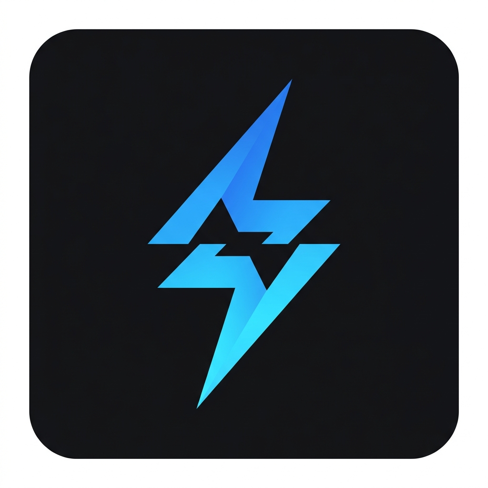

# ⚡ ClaudePulse

<div align="center">
  
  
  <p><strong>Real-time session & weekly usage tracking for Claude AI with zero telemetry.</strong></p>

  [](https://opensource.org/licenses/MIT)
  [](#)
  [](#)
  [](#)

</div>

<br />

## 📝 About

ClaudePulse is a powerful, lightweight Chrome Extension designed for power users of Claude AI. It seamlessly intercepts network data to provide pinpoint accurate usage stats and integrates elegantly into the native Claude user interface. Best of all? It's 100% local, safe, and telemetry-free.

---

## 📑 Table of Contents

- [Features](#-features)
- [Previews](#-previews)
- [How It Works](#-how-it-works)
- [Installation Guide](#-installation-guide)
- [Folder Structure](#-folder-structure)
- [Troubleshooting](#-troubleshooting)
- [Privacy First](#-privacy-first)
- [Release Notes](RELEASE_NOTES.md)


---

## ✨ Features

- **📊 Live Token & Capacity Tracking:** Pinpoint accuracy on your 5-hour session and 7-day limits.
- **🎨 Native Glassmorphism UI:** Seamlessly integrates floating progress components directly inside the Claude composer window. Looks exactly like native Anthropic design!
- **🔔 Smart Background Alerts:** Notifies you instantly when you hit warning thresholds (e.g., 80% capacity) and when your limit resets via native Chrome alarms.
- **🛠️ Minimal Dashboard:** Click the extension icon to view a sleek, dark/light theme popup containing robust data on active timers and tracked context tokens.
- **🛡️ Battle-Tested Architecture:** Instead of scraping the DOM (which breaks constantly), it uses a `MAIN` world script to securely monitor inbound Chrome network API payloads dynamically.

---

## 📸 Previews

> *(Note: You can add your actual screenshot paths here for GitHub)*
> 
> - **Popup UI:** ``
> - **In-App Strip:** ``

---

## 🧠 How It Works

Historically, most browser extensions for LLM clients rely on fragile HTML "DOM scraping." When the LLM provider updates their CSS classnames, the extension completely breaks. 

**ClaudePulse** solves this permanently:
1. **Interceptor:** Pushes `interceptor.js` straight into the webpage's active execution core using `chrome.scripting`.
2. **API Sniffing:** Passively listens to `GET .../usage` and `.../completion` SSE streams, cleanly intercepting token usages without modifying requests or interrupting Claude.
3. **Event Dispatch:** Safely communicates the mathematical payload via a secure `window.dispatchEvent` boundary into the Extension Content Script.
4. **State Management:** Processes the data inside `chrome.storage.local` and mirrors it live to the popup widget and the on-page Glass UI strip.

---

## 🛠️ Installation Guide

Follow these steps to install **ClaudePulse** in your browser using Developer Mode:

### 1. Download the Project
- **Option A (Git):** Clone this repository using `git clone https://github.com/dev-smashik/Claude-AI-Session-monitor-Chrome-Extention.git`
- **Option B (ZIP):** Download the repository as a ZIP file from GitHub and extract it to a folder on your computer.

### 2. Open Chrome Extensions
- Launch Google Chrome.
- In the address bar, type `chrome://extensions/` and press Enter.
- Alternatively, click the **three dots** (Menu) > **Extensions** > **Manage Extensions**.

### 3. Enable Developer Mode
- In the top-right corner of the Extensions page, toggle the **Developer mode** switch to **ON**.

### 4. Load the Extension
- Click the **Load unpacked** button that appears in the top-left corner.
- In the file picker, navigate to and select the **root folder** of this project (the folder containing `manifest.json`).

### 5. Finalize Setup
- **Pin the Extension:** Click the "Puzzle" icon (Extensions) in your Chrome toolbar and click the **Pin** icon next to **ClaudePulse**.
- **Refresh Claude:** Navigate to [Claude.ai](https://claude.ai) and refresh the page to initialize the tracker.

> [!NOTE]
> You must keep the project folder on your computer for the extension to continue working. If you move or delete the folder, the extension will be removed from Chrome.


---

## 🗂️ Folder Structure

This extension was deliberately built without build tools (No Webpack, No Rollup) so it remains highly readable, hackable, and completely transparent:

```text
ClaudePulse/
├── manifest.json
├── README.md
├── icons/                 # Extension logos (16/48/128 px)
└── src/
    ├── background/
    │   └── service-worker.js    # Persistent Chrome Alarms & Native Notifications
    ├── content/
    │   ├── monitor.js           # Brain of the Content Script / Orchestrates DOM logic
    │   └── ui-elements.js       # Renders the Glass-Morphism strip into Claude's UI
    ├── injected/
    │   └── interceptor.js       # Lives in the 'MAIN' world. Sniffs network requests flawlessly.
    ├── popup/
    │   ├── popup.html
    │   ├── popup.js             # Controls popup dashboard state & live toggles
    │   └── styles.css
    └── utils/
        ├── logger.js
        └── storage.js           # Smart async wrapper for chrome.storage.local resolving defaults globally
```

---

## 🐛 Troubleshooting

If you are developing or experiencing bugs:
- **UI Element Not Appearing?** If Claude drastically updates their composer DOM layout, the `_findAnchor()` function inside `src/content/ui-elements.js` handles structural fallbacks but may need a minor alignment tweak.
- **Forcing UI States:** You can push mock data to see how the UI reacts without wasting prompt capacity. Open the Service Worker console in `chrome://extensions` and run:
  ```javascript
  chrome.storage.local.set({ 
    usage: { 
      session: { pct: 85, resetsAt: new Date(Date.now() + 3600000).toISOString() }, 
      weekly: { pct: 50 },
      synced: true
    } 
  });
  ```

---

## 🔒 Privacy First

Transparency is absolutely critical when granting extension storage and script running permissions:
- **No Data Collection:** This extension processes numeric data entirely locally. It does not collect, transmit, trace, or monetize any of your prompt/response text.
- **Isolated Domain Execution:** The network interceptors exclusively execute on the `*://claude.ai/*` origin framework.

---

## 🚀 Release History

Stay up to date with the latest features and fixes by checking our [Release Notes](RELEASE_NOTES.md).

---

<div align="center">
  <i>Built with ❤️ for power users of Claude AI</i>
</div>